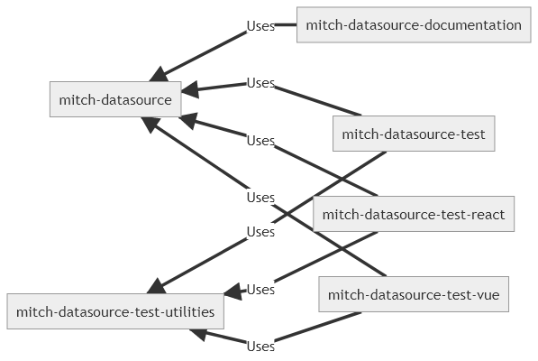

# Development

## Overview

This repository contains multiple projects. Each project has a specific set of responsibilities.
The main project is `mitch-datasource`, which contains the base source code.

Project Name | Description
--- | ---
`mitch-datasource` | The code datasource codebase. The NPM package is deployed from this folder.
`mitch-datasource-documentation` | The project to generate the documentation from the codebase and markdown files. That is, it generates the current documentation which you are viewing right now.
`mitch-datasource-test` | Performs automated tests for the core datasource codebase.
`mitch-datasource-test-react` | A playground application (using storybook) so integration tests with React can be manually performed. Manual tests can also be done here.
`mitch-datasource-test-vue` | A playground application (using storybook) so integration tests with Vue can be manually performed. Manual tests can also be done here.
`mitch-datasource-test-utilities` | Contains the core code for testing purposes, such as mocks, or stub data.

The relationship between all the above projects can be illustrated as per below:

Each project has their own set of scripts which you can run. However, for general use,
you can simply just use the scripts located at the root of this repository in `package.json`.
These scripts run convenient tasks when developing the application, and saves you the trouble of switching directories/terminals to execute individual scripts for each project.

### Major Dependencies
* [axios](https://www.axios.com)
  * Used to perform default AJAX operations
* [query-string](https://github.com/sindresorhus/query-string#readme)
  * For `QueryBuilder` (Used as part of `AJAX Datasource`) to convert an object to a query string

### Technologies Used

This package was created using:
* `webpack` as the bundler
* `npm` scripts to run common tasks (e.g. build and sass compilation), instead of gulp, grunt
* `babel` with webpack to transpile JavaScript from ES6 to ES5, so this package codebase can utilise the newest ES6 features
* `esdoc` to build the API documentations
* `eslint` for linting JavaScript source code
* `nodemon` to set up npm watch scripts (to auto-compile when code changes are detected)
* `npm-run-all` to run multiple npm scripts in sequence/parallel whilst being compatible cross operating systems (e.g. Windows, Linux, etc)
* `jest` for running tests
* `storybook` to develop playground applications to perform manual integration tests with client-side frameworks (e.g. React, Vue).
* `esm` to use modern ES import/export syntax (for executing node scripts without the need for webpack).
* `mermaid cli` to generate mermaid diagrams using markdownish syntax (i.e. `.mmd` files).
* `glob` retrieve all files within a folder matching an expression.

## Repository Scripts

### Installation Scripts

To run the script, simply open up terminal and change directory to where the root `package.json` resides.
Afterwards, simply type in `npm run <ScriptName>`. For example, `npm run install`.

Script Name | Description
--- | ---
`install` | Performs an `npm install` for every projects inside the `projects` folder.
`update` | Performs an `npm update` for every projects inside the `projects` folder.
`exec-all-projects` | Performs a specified command for every projects inside the `projects` folder. For example `npm run exec-all-projects -- "npm outdated"`.

### Main Scripts

Script Name | Description
--- | ---
`dev` | Lint, test, build/compile the code and docs using development settings.
`prd` | Lint, test, build/compile the code and docs using production settings.
`watch` | Lint, test, build/compile the code and docs using development settings when a relevant file has been changed.
`storybook` | Runs the storybook applications for Vue & React. For manual integration tests with client-side frameworks (e.g. React, Vue).

### Other Scripts

Script Name | Description
--- | ---
`docs-build` | Build the documentation.
`docs-watch` | Build the documentation when a relevant file has been changed.
`code-dev` | Lint and build the code using development settings.
`code-prd` | Lint and build the code using production settings.
`code-watch` | Lint and build the code using development settings when a relevant file has been changed.
`test-utilities-dev` | Lint and build the test utilities project with development settings.
`test-utilities-prd` | Lint and build the test utilities project with production settings.
`test-utilities-watch` | Lint and build the test utilities project with development settings when a relevant file has been changed.
`test` | Run tests.
`test-watch` | Run tests when a relevant file has been changed.
`react-storybook` | Runs the storybook application for React. For manual integration tests with client-side frameworks (e.g. React, Vue).
`vue-storybook` | Runs the storybook application for Vue. For manual integration tests with client-side frameworks (e.g. React, Vue).

## Projects

### mitch-datasource

The main project containing the source code for mitch-datasource.
This project is published as a package to NPM registry.

#### Available NPM Scripts

##### Main Scripts

Script Name | Description
--- | ---
`dev` | Lint, build code & docs with development settings.
`prd` | Lint, build code & docs with production settings.
`watch` | Lint, build code & docs with development settings anytime when a change has been detected.

##### Other Scripts

Script Name | Description
--- | ---
`dev` | Lint and build the code with development settings.
`prd` | Lint and build the code with production settings.
`watch` | Lint and build code with development settings anytime when a change has been detected.
`webpack-watch` | Build code anytime when a change has been detected.
`webpack-build-dev` | Build code with development settings.
`webpack-build-prd` | Build code with production settings.
`lint` | Lint the source code, finding any errors or code smells.
`lint-watch` | Lint the source code anytime when a change has been detected
`lint-fix` | Automatically fix any auto-fixable warnings or errors detected when linting.

### mitch-datasource-documentation

Generates the HTML documentation based on source code in the `mitch-datasource` project, and the markdown files in the `manual` folder. The built HTML documentation files will reside in the `docs` folder.

#### Available NPM Scripts

##### Main Scripts

Script Name | Description
--- | ---
`build` | Generate Diagrams and then build the HTML documentation to the `docs` folder.
`watch` | Generate Diagrams and then build the HTML documentation when a relevant file has been changed.

##### Other Scripts

Script Name | Description
--- | ---
`build-mermaid` | Generate diagrams to the `docs` folder.
`watch-mermaid` | Generate diagrams when a relevant file has been changed (i.e. `.mmd` files in `manual/asset/`).
`build-esdoc` | Build the HTML documentation to the `docs` folder.
`watch-esdoc` | Build the HTML documentation when a relevant file has been changed.

### mitch-datasource-test

Automated tests for the core codebase.

#### Available NPM Scripts

##### Main Scripts

Script Name | Description
--- | ---
`test` | Run the `jest` tests.
`test-debug` | Run the `jest` tests under debug mode which you can put breakpoints under.
`test-watch` | Run the `jest` tests when a relevant file has been changed.
`lint` | Lint the tests source code, finding any errors or code smells.
`lint-fix` | Fixes the automatically fixable lint errors.

### mitch-datasource-test-react

Based on `Create React App`, but with storybook installed.

#### Available NPM Scripts

##### Main Scripts

Script Name | Description
--- | ---
`storybook` | Runs the storybook application.

##### Other Scripts

Script Name | Description
--- | ---
`test` | Run React tests
`build-storybook` | Exports the storybook as a static app.

### mitch-datasource-test-vue

Initially created with default stock Vue project. Storybook was installed afterwards.

#### Available NPM Scripts

##### Main Scripts

Script Name | Description
--- | ---
`storybook` | Runs the storybook application.

##### Other Scripts

Script Name | Description
--- | ---
`lint` | Lint the Vue code.
`build-storybook` | Exports the storybook as a static app.

### mitch-datasource-test-utilities

Contains the core exports for testing purposes, such as mocks or data stubs.

#### Available NPM Scripts

##### Main Scripts

Script Name | Description
--- | ---
`dev` | Performs linting and builds the codebase.
`prd` | Performs linting and builds the codebase.
`watch` | Performs linting and builds the codebase.
`build-dev` | Performs linting and builds the codebase.
`build-prd` | Performs linting and builds the codebase.
`lint` | Lint the source code, finding any errors or code smells.
`lint-watch` | Lint the source code anytime when a change has been detected
`lint-fix` | Automatically fix any auto-fixable warnings or errors detected when linting.

##### Other Scripts

Script Name | Description
--- | ---
`lint` | Lint the Vue code.
`build-storybook` | Exports the storybook as a static app.